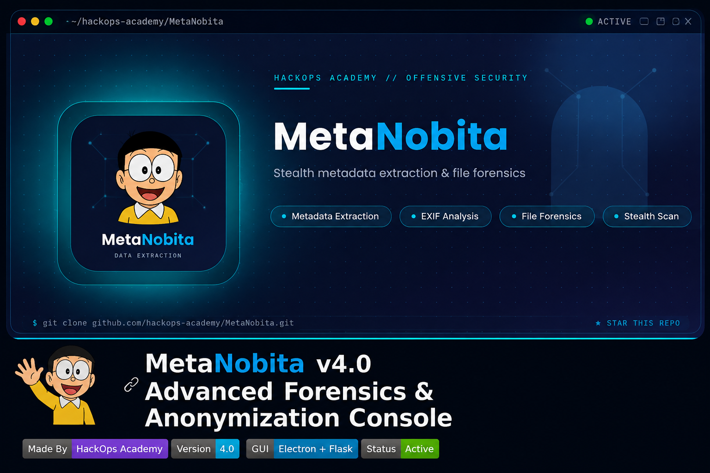
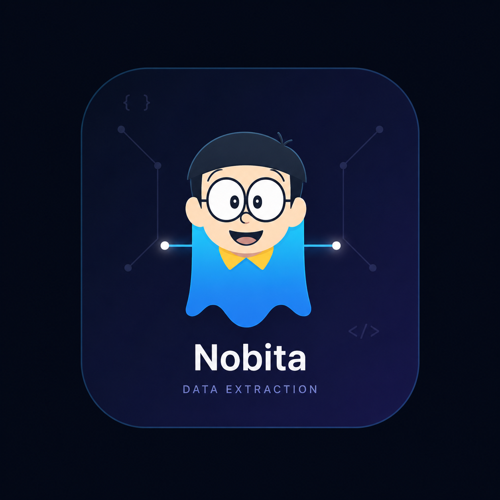

<p align="center">
  
</p>

# 👻 nobitameta v4.0 — Advanced Forensics & Anonymization Console


**nobitameta** is a metadata forensics and privacy-scrubbing engine built by
**NOBITA Academy**. v4.0 rebuilds it as a full desktop GUI application — the
same engine, same offline-first philosophy, now with a proper HUD console
instead of a bare terminal menu.

The architecture mirrors [Glacier](https://github.com/NOBITA-academy),
NOBITA Academy's flagship pentesting toolkit: a small local Flask API doing
the real work, and an Electron shell providing a native desktop window and
file-system dialogs around it.

---

<p align="center">
  
</p>

## ⚡ What's new in v4.0 (GUI Edition)

- **Native desktop app** — Electron HUD with a dark, HUD-styled console
  instead of a raw terminal menu. Native file/folder pickers, no uploads.
- **Composite risk scoring** — every extracted tag is classified
  Critical / High / Medium / Low and rolled into an overall exposure score,
  not just a flat "risky/not risky" flag.
- **Dashboard** — at-a-glance counters for critical findings, files cleaned,
  and recent activity across the whole session.
- **Reports & History panes** — every analysis report and every operation
  (analyze, GPS lookup, scrub, bulk scrub) is logged locally and browsable.
- **Still 100% offline.** The Flask API only ever binds to `127.0.0.1`; no
  data leaves the device.
- The original terminal tool, `nobitameta.sh`, is kept as-is for headless /
  Termux / SSH use.

---

## 🧠 Core Capabilities

| Module | What it does |
|---|---|
| **Deep Analysis** | Full metadata extraction via `exiftool`, risk-classified per tag, exported as a styled HTML report. |
| **GPS Forensics** | Pulls exact capture coordinates (+ altitude, direction, timestamp, speed) and links straight to Google Maps. |
| **Secure Scrub** | Strips all metadata from a file. Original is always backed up first, cleaned copy written separately. |
| **Bulk Scrub** | Sanitizes every file in a folder in one pass, with a per-file pass/fail breakdown. |
| **Reports** | Browse every HTML report nobitameta has generated this install. |
| **History** | Local audit log of every operation run, with timestamps and risk outcomes. |

---

## 🚀 Installation & Usage (GUI)

Requires Python 3.9+, Node.js/npm, and `exiftool`.

```bash
git clone https://github.com/rammali001234/nobitameta.git
cd nobitameta

./setup.sh   # one-time: installs exiftool (if missing), Python venv, Electron deps
./start.sh   # launches the API + opens the nobitameta HUD window
```

`start.sh` uses `tmux` to run the API server and the Electron HUD side by
side if `tmux` is available; otherwise it starts the API in the background
and launches the HUD in the foreground.

Inside the app: pick a file with **Browse…**, run the operation, and the
result — risk report, GPS pin, cleaned file, or bulk summary — renders right
in the console. **Reveal in Folder** and **Open Report** buttons hand off to
your OS file manager / browser directly via Electron, so nothing has to be
manually copied out of a temp directory.

### Manual (no tmux)

```bash
# Terminal 1
cd server && ../venv/bin/python3 server.py

# Terminal 2
cd hud && npm start
```

### Install as a desktop app (Kali / Debian-based)

Prefer a proper Applications-menu entry and a `nobitameta` terminal command
over running it from the cloned repo each time? Use the installer instead
of `setup.sh`/`start.sh`:

```bash
./packaging/install.sh     # installs to ~/.local/share/nobitameta, adds
                            # a menu entry, an icon, and a `nobitameta` command
nobitameta                  # launch it from anywhere

./packaging/uninstall.sh   # removes everything the installer created
```

See `packaging/README.md` for exactly what gets installed where.

---

## 🖥️ Installation & Usage (classic terminal tool)

The original bash tool still works standalone — handy for Termux, headless
boxes, or SSH sessions where a GUI isn't an option:

```bash
chmod +x nobitameta.sh
./nobitameta.sh
```

See the in-app menu for Deep Analysis, GPS Forensics, Secure Scrub, and
Bulk Scrub — identical feature set to the GUI, terminal-only.

---

## 📂 Project Layout

```
nobitameta/
├── nobitameta.sh          # original terminal tool (kept, standalone)
├── server/
│   ├── engine.py          # core forensics engine (exiftool, risk scoring, scrub)
│   └── server.py          # local Flask API (127.0.0.1:8077)
├── hud/
│   ├── main.js             # Electron main process (native dialogs, IPC bridge)
│   ├── preload.js          # context-isolated bridge exposed to the renderer
│   ├── index.html          # the HUD console UI
│   └── package.json
├── assets/                # logo, banner
├── packaging/              # desktop install/uninstall
│   ├── install.sh
│   ├── uninstall.sh
│   ├── bin/nobitameta        # installed launcher command
│   └── nobitameta.desktop    # menu entry template
├── reports/                # generated HTML forensic reports
├── clean_output/           # scrubbed files land here
├── backups/                 # originals backed up here before scrubbing
├── setup.sh
└── start.sh
```

---

## 🧭 Use Cases

1. **OSINT Investigations** — pinpoint exactly where a photo was taken.
2. **Privacy Protection** — scrub GPS/device metadata before posting online.
3. **Forensic Analysis** — spot signs of editing, identify device/software
   fingerprints left behind in a file.

---

## ⚠️ Disclaimer

This tool is designed for educational purposes, digital forensics, and
privacy protection. NOBITA Academy is not responsible for any misuse of
this tool. Always ensure you have permission before analyzing files that
do not belong to you.

<p align="center">
Made with by https://t.me/classlight
</p>
